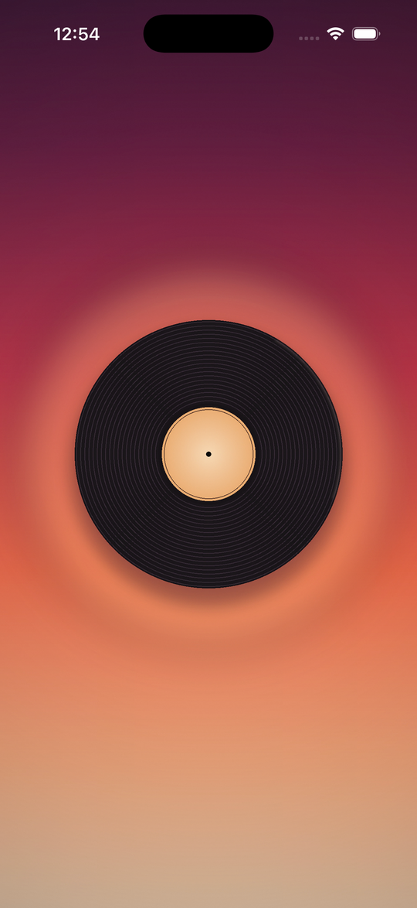
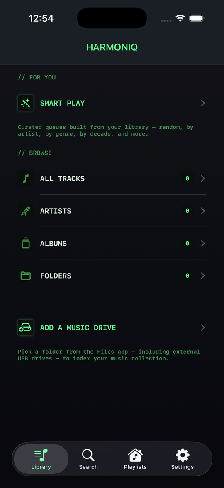
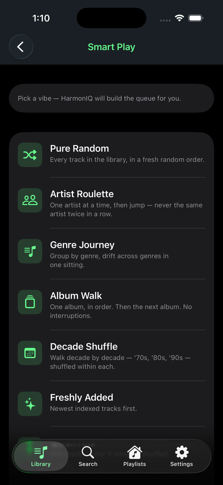
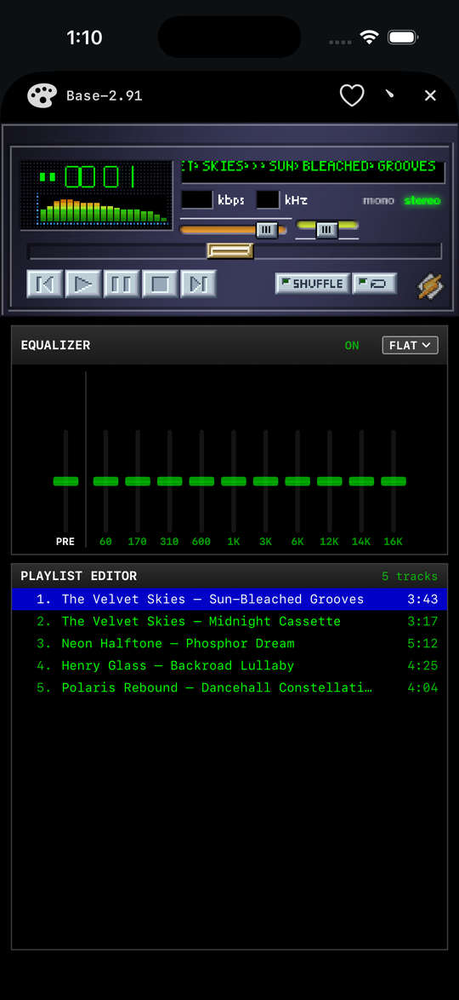

# HarmonIQ

A SwiftUI music player for iPhone and iPad, styled after the classic Winamp era. Plays audio files straight off any folder you can mount in Files — including USB drives — and ships its index alongside the music so the same drive works on any device without re-scanning.

## Screenshots

| Sun-Bleached Grooves launch | Winamp-flavored Library |
|---|---|
|  |  |

| Smart Play curators | Skinned (Winamp) player |
|---|---|
|  |  |

## Features

- **Drive-portable library.** Tracks, playlists, and artwork live in a `HarmonIQ/` folder on the drive itself. Plug the same drive into another iPhone and your library shows up unchanged.
- **External-drive friendly.** Pick any folder Files can see (USB-C drives, SMB shares, iCloud Drive, on-device storage). Read-only locations are supported via a sandbox shadow store.
- **Background playback** with full lock-screen / Control Center / CarPlay-style controls via `MPNowPlayingInfoCenter`.
- **Winamp skins.** Drop classic `.wsz` files in via the importer; bundled skins ship with the app. Skinned main window, equalizer, and playlist all render from the original sprites.
- **SmartPlay queues.** Twelve curators including Pure Random, Artist Roulette, Album Walk, Decade Shuffle, Discovery Mix, Mood Arc, Deep Cut, and One Per Artist — built on top of your library.
- **Live visualizer.** Eight selectable styles (spectrum, oscilloscope, plasma, mirror, radial pulse, particles, fire, starfield) on the SwiftUI player; the skinned player honors the same choice within Winamp's pixel-grid + palette constraints. Long-press or double-tap to cycle.
- **Sleep timer.** Auto-stop after a fixed duration (15/30/45/60 min) or at the end of the current track, with a live LCD countdown.

## Requirements

- iOS 16+
- Xcode 15 / Swift 5.9
- [XcodeGen](https://github.com/yonaskolb/XcodeGen) (`brew install xcodegen`) — `project.yml` is the source of truth, the `.pbxproj` is generated.

## Build

```bash
xcodegen generate
xcodebuild -project HarmonIQ.xcodeproj -scheme HarmonIQ \
  -destination 'platform=iOS Simulator,name=iPhone 17' build
```

If `xcodebuild` complains about missing tools, prefix the command with `DEVELOPER_DIR=/Applications/Xcode.app/Contents/Developer`.

There is no test target and no lint config — `xcodebuild` is the only check.

## Architecture sketch

Four `@MainActor` singletons, injected at app launch:

| | |
|---|---|
| `LibraryStore` | Aggregates tracks/playlists across all mounted drives. |
| `AudioPlayerManager` | `AVAudioPlayer` wrapper — queue, shuffle, repeat, audio levels. |
| `MusicIndexer` | Detached file walker that writes the index to the drive's `HarmonIQ/` folder. |
| `NowPlayingManager` | Bridges `MPRemoteCommandCenter` to the player. |

Every drive carries `HarmonIQ/library.json`, `HarmonIQ/playlists.json`, and `HarmonIQ/Artwork/` at its root. The app sandbox holds only `roots.json` (the device's bookmarks) and a local artwork mirror — see `CLAUDE.md` for the full persistence model.

## Layout

```
HarmonIQ/
  HarmonIQApp.swift          # Composition root
  Models/                    # Track, Playlist
  Persistence/               # LibraryStore, DriveLibraryStore, BookmarkStore
  Indexer/                   # Music indexer + metadata extractor
  Player/                    # AudioPlayerManager, NowPlayingManager, SmartPlay
  Skins/                     # .wsz parsing + skin manager
  Views/
    Skin/                    # Skinned (Winamp) UI
    *.swift                  # Native SwiftUI library, search, settings
    WinampTheme.swift        # Shared design system
  Resources/Skins/           # Bundled .wsz files
design/                      # Icon design + render script
project.yml                  # XcodeGen source
```

## Releases

See [GitHub Releases](https://github.com/LeoHChen/HarmonIQ/releases) for the full notes and tag history.

### v0.4 — 2026-05-02
- **Sleep timer**: stop after 15/30/45/60 min or at the end of the current track; live LCD countdown sits in the player transport.
- **Visualizer overhaul**: 8 selectable styles (spectrum, oscilloscope, plasma, mirror, radial pulse, particles, fire, starfield); active style persists across launches; long-press or double-tap the visualizer to cycle. The skinned (Winamp) player honors the same choice within its 76×16 + palette constraints.
- **SmartPlay**: three new rule-based modes — Mood Arc (high-energy → wind-down), Deep Cut (skip openers and "Greatest Hits" comps), One Per Artist (max library breadth).
- **Branded launch screen**: Sun-Bleached Grooves splash matching the app icon (sunset gradient + black vinyl disc, no tonearm).
- **Performance**: throttle `currentTime` publish to ~2 Hz, gate the visualizer + display link on view visibility, pause the display link when the app backgrounds. Substantially fewer SwiftUI invalidations during normal playback.
- **Reliability**: fixed several Sendable / actor-isolation issues around background/foreground notification observers (no more compile-time isolation warnings; no spurious main-actor hops).
- Repeat-one indicator: subtle "1" badge on the repeat button when single-track loop is active.

### v0.3 — 2026-05-01
- Albums and Artists drill-downs work again (taps push into detail instead of looping).
- Album detail header redesigned: centered Winamp card with aligned PLAY / SHUFFLE.
- "PLAYER" row in BROWSE returns to the now-playing sheet; icon pulses with a live audio-level glow + 3-bar mini-VU.
- Skin picker overhauled: tap to cycle, long-press for a scrollable sheet, mirrored on the SwiftUI player.
- Four more bundled skins: Bento Classified, Crystal Display, Glass Factory, Luna Steel.
- Recent searches persisted (LRU, 10), shown when the search field is empty.
- README added.

### v0.2 — 2026-05-01
- EQ and Playlist panels now skin alongside the main player; switching skins recolors the entire now-playing sheet.
- Skin picker added to the SwiftUI (None) player.
- Mini player removed (auto-present-on-tap handles reopening the player).
- Fixed bogus read-only flag on every picked folder; on-drive index writes now work on writable locations.
- Folder delete added to Library → Folders view.

### v0.1
- Initial release.

## Feedback & feature requests

HarmonIQ is built in the open. **Have an idea, hit a bug, or just miss a feature from your favorite player?** Open an issue — that's the most direct way to land it on the roadmap:

- [🚀 Request a feature](https://github.com/LeoHChen/HarmonIQ/issues/new?labels=enhancement&title=Feature%20request%3A%20)
- [🐛 Report a bug](https://github.com/LeoHChen/HarmonIQ/issues/new?labels=bug&title=Bug%3A%20)
- [💬 Browse open issues / vote with 👍](https://github.com/LeoHChen/HarmonIQ/issues)

PRs are welcome too. The project's small, the architecture is documented in [`CLAUDE.md`](CLAUDE.md), and there's a smoke checklist in [`TESTING.md`](TESTING.md) to verify changes before merging.

## Acknowledgements

Skin parsing leans on classic Winamp 2.x specs and the file format documented at [archive.org's Winamp Skin Museum](https://archive.org/details/winampskins).
